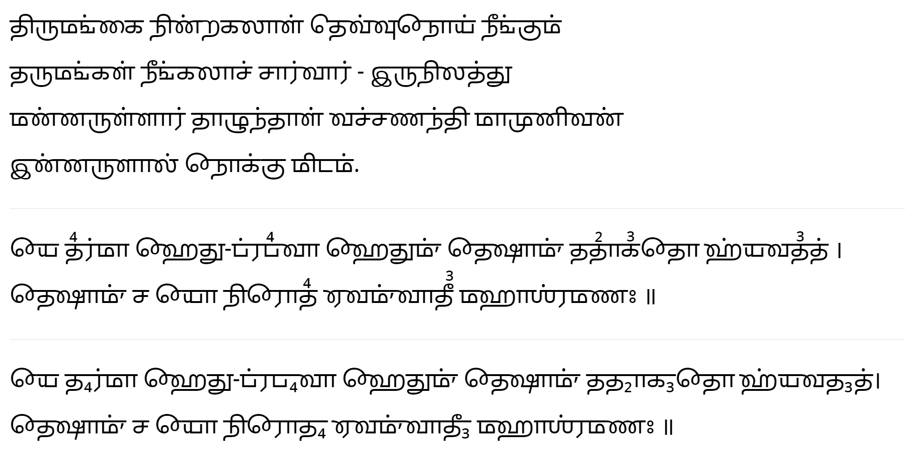

# Vajranandi Tamil

An alternative imagination of the Tamil script had it evolved like the nothern Indic scripts with a shared serif exending as a horizontal line over the characters.

You can read the font documentation [here](http://www.virtualvinodh.com/projects/vajranandi).

# Sample #

திருமங்கை நின்றகலாள் தெவ்வுநோய் நீங்கும் 
தருமங்கள் நீங்கலாச் சார்வார் - இருநிலத்து 
மன்னருள்ளார் தாழுந்தாள் வச்சணந்தி மாமுனிவன் 
இன்னருளால் நோக்கு மிடம். 
 
யே த⁴ர்மா ஹேது-ப்ரப⁴வா ஹேதும்ʼ தேஷாம்ʼ ததா²க³தோ ஹ்யவத³த் । 
தேஷாம்ʼ ச யோ நிரோத⁴ ஏவம்ʼவாதீ³ மஹாஶ்ரமண꞉ ॥ 
 
யே த₄ர்மா ஹேது-ப்ரப₄வா ஹேதும்ʼ தேஷாம்ʼ ததா₂க₃தோ ஹ்யவத₃த்।
தேஷாம்ʼ ச யோ நிரோத₄ ஏவம்ʼவாதீ₃ மஹாஶ்ரமண꞉ ॥ 
 

# Demo #

You can find various texts rendered in Vajranandi [here](https://virtualvinodh.github.io/vajranandi-tamil/test_page_vajranandi.html)
